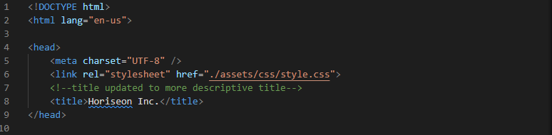
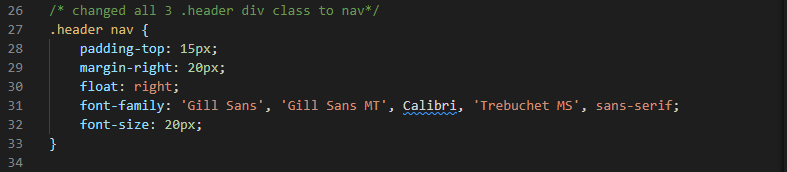

# code-refactor

# Horiseon Social Media Marketing

## Code Refactoring for ADA accessability 

 This project is a app featuring summaries of services offered by Hariseon Marketing. Included you will find HTML and CSS documents; and image files.
 HTML had been updated with identifying tags to ease future updates.
 ADA accessibility attributes were added to optimizes SEO results and which is important for reaching all audiences. 
 During this project I put to use my basic HTML and CSS knowledge for essential debugging and implementing HTML attributes to increase accessability. 

[Click here for Hariseon live sample](https://sophtron5000.github.io/code-refactor/)

## Features

* ADA accessible attributes
* Optimized source code with sematic HTML
* Added comments for ease of reader
* Semantic CSS selectors

## Table of Contents

* [Installation](#installation)
* [Usage](#usage)
* [Credits](#credits)
* [License](#license)

## Installation

System requirements: latest version of Visual Studio Code, GitHub account, GitBash

1. open GitHub link provided in default browser [Click here for Hariseon live sample](https://sophtron5000.github.io/code-refactor/)
2. select the green "code" button; and copy the SSH key
3. in GitBash change directory to desired save location
4. run command: "git clone (*paste SSH key here*)" (without quotes)
5. once saved to your terminal, launch app on your preferred code editor

## Usage 

* Navigate HTML and CSS in Visual Studio Code 
* Make necessary edits in Visual Studio Code
* Push to desired repository/deployment platform for potential clients to enjoy

## Credits

Sophia Custodia
[Linkedin](https://www.linkedin.com/in/sophia-custodia/)

[w3School](https://w3schools.com/)

## License

Copyright (c) [2022] [SophiaCustodia]

Permission is hereby granted, free of charge, to any person obtaining a copy
of this software and associated documentation files (the "Software"), to deal
in the Software without restriction, including without limitation the rights
to use, copy, modify, merge, publish, distribute, sublicense, and/or sell
copies of the Software, and to permit persons to whom the Software is
furnished to do so, subject to the following conditions:

The above copyright notice and this permission notice shall be included in all
copies or substantial portions of the Software.

THE SOFTWARE IS PROVIDED "AS IS", WITHOUT WARRANTY OF ANY KIND, EXPRESS OR
IMPLIED, INCLUDING BUT NOT LIMITED TO THE WARRANTIES OF MERCHANTABILITY,
FITNESS FOR A PARTICULAR PURPOSE AND NONINFRINGEMENT. IN NO EVENT SHALL THE
AUTHORS OR COPYRIGHT HOLDERS BE LIABLE FOR ANY CLAIM, DAMAGES OR OTHER
LIABILITY, WHETHER IN AN ACTION OF CONTRACT, TORT OR OTHERWISE, ARISING FROM,
OUT OF OR IN CONNECTION WITH THE SOFTWARE OR THE USE OR OTHER DEALINGS IN THE
SOFTWARE.

## Contributing

For educational purposes only.

